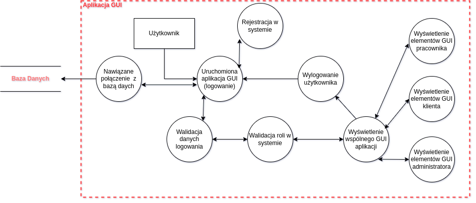
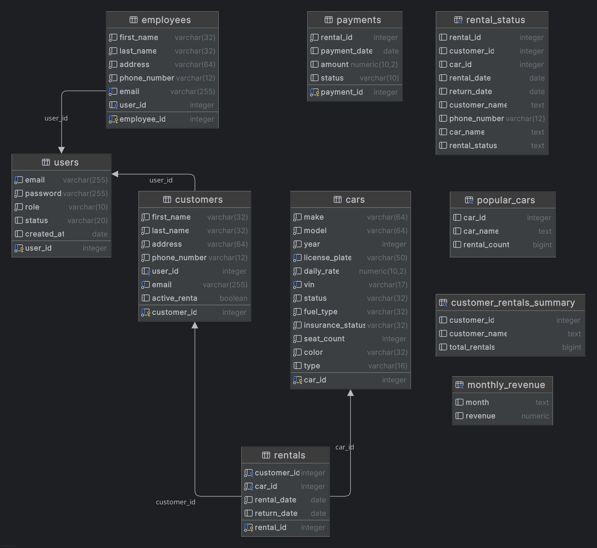

# Car Rental App

## Author
- Przemysław Ryś

## logowanie
Aktualna baza umożliwia zalogowanie na konta:

### Administrator: 
- login: prys@poczta
- hasło: admin

### Pracownik: 
- login: mpawlik@poczta
- hasło: haslo

### Klient (można rejestrować nowe konto): 
- login: musial@poczta.pl
- hasło: musial

## Opis
Aplikacja wypożyczalni samochodowej poprzez system autoryzacji umożliwia różne widoki aplikacji w zależności od roli użytkownika

### Administrator
  - Zarządzanie użytkownikami systemu (pracownicy, klienci).
  - Dostęp do wszystkich raportów.

### Pracownik
  - Obsługa wypożyczeń i zwrotów samochodów.
  - Podgląd dostępnych samochodów i klientów.
  - Zarządzanie flotą samochodową

### Klient
  - Przeglądanie dostępnych samochodów.
  - Wypożyczanie dostępnych samochodów.

## Diagram DFD

## Diagram ERD

